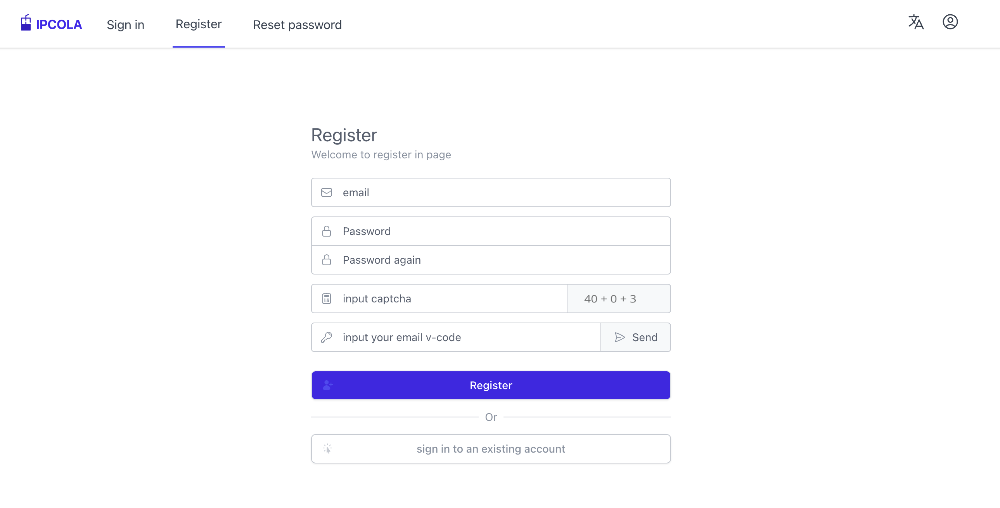

# ✨ 比特指纹浏览器使用IPCola教程

1\. 点击[**此处**](https://dashboard.ipcola.com/)进入IPCola官网，注册并登录，进入IPCola后台

<figure><figcaption></figcaption></figure>

2\. 点击[**此处**](https://www.bitbrowser.cn/)进入比特浏览器官网，下载软件，并注册登录

<figure><figcaption></figcaption></figure>

3\. 通过**账密认证**获取代理，设置下面的几步就可以了

一、创建账户，您可点击**动态代理—账户管理—添加**，进行创建（我视频内设置成了`ipcola123`，可以<mark style="color:red;">**根据自己情况设置账号密码**</mark>）

二、购买流量包，您可点击**动态代理—流量包管理—购买流量包**，此流量包只支持动态轮转IP，如果需要数据中心轮转ip需要另外购买

三、生成账号密码，您可点击**动态代理—账密模式—增加需要的参数—点击生成链接**，代理类型上ipcola同时支持HTTP与SOCKS5。



